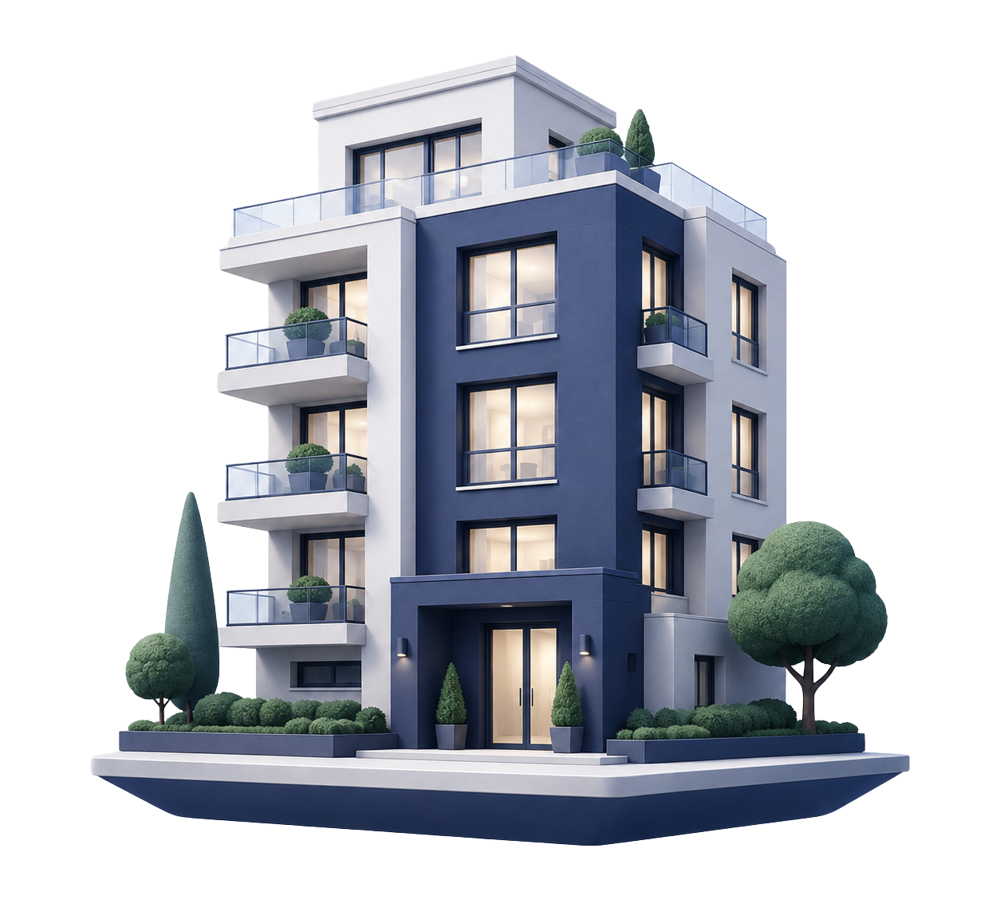
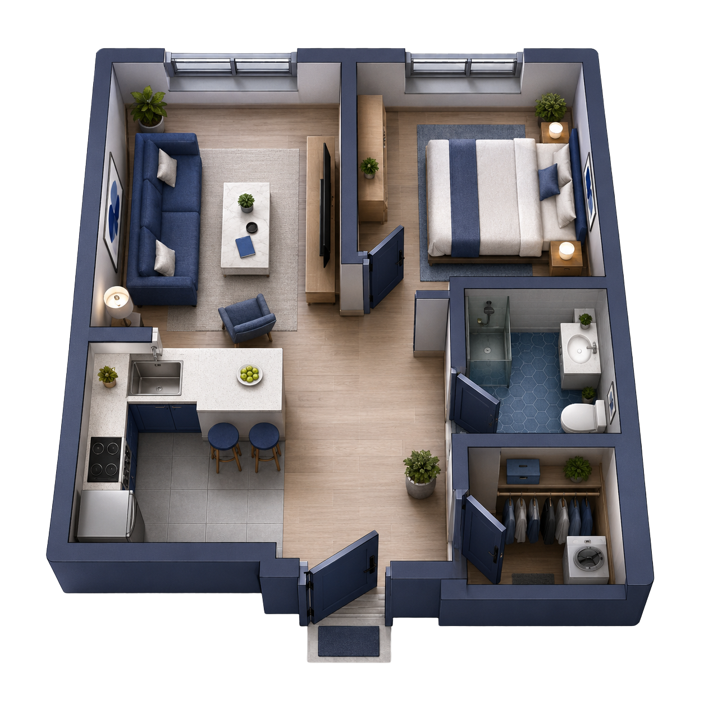
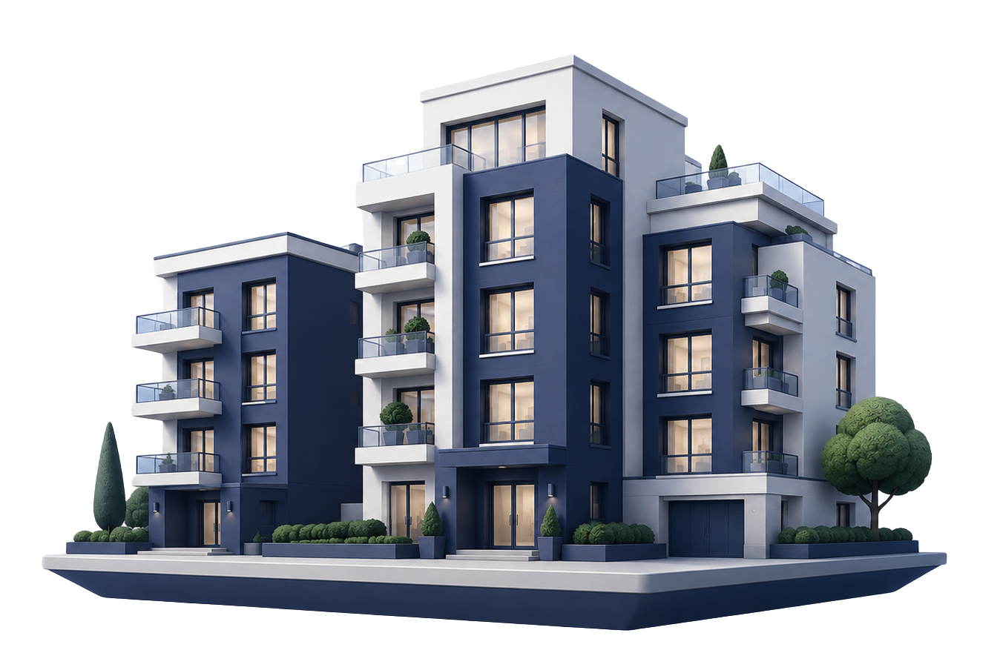

# Landing Page Asset Prompts - Cartoon 3D With Image References

## Master Visual Direction

Use this global prompt as the base style for every generated asset:

"Stylized cartoon-like 3D illustration for a premium real-estate analysis product, clean geometric forms, playful but refined proportions, elegant floating cutout composition, transparent background PNG, soft depth and soft shadows, deep brand blue #34306A with complementary blue grays, modern European property aesthetic, polished and friendly, premium SaaS feel, crisp edges, low clutter, simplified forms, reduced detail, minimal surface texture, few secondary elements, broad clean color areas, expressive but not childish, no tiny decorative details, no busy facades, no orange tones, no purple cast, no photorealistic stock-photo look, no visible text overlays, no watermarks, no logos, leave negative space where the layout may need breathing room."

## Simpler Output Modifier

If you want any asset to look more simplistic and less detailed, append this modifier to that asset prompt:

"Use very simple chunky forms, fewer windows and architectural details, reduced texture, minimal props, low scene complexity, broad color blocking, smooth surfaces, and a cleaner almost icon-like silhouette while keeping the premium cartoon-style 3D look."

## Asset 1: Hero Main Visual

Suggested file name: `hero-property-analysis.png`

Preview:

Placement:

- Right side of the hero section in [resources/js/Pages/Public/Landing.tsx](resources/js/Pages/Public/Landing.tsx)

Prompt:

"Cartoon-style 3D illustration of a premium apartment building or elegant apartment volume combined with subtle real-estate analysis cues, floating cutout object, transparent background PNG, simplified architectural shapes, calm blue-gray palette, soft shadows, polished but playful, suggests property valuation, risk checking, and confident decision-making without showing an actual app screen, include a small floating report page tucked near the upper corner of the building so it reads as part of the object composition, scale the main subject to feel about 1.3 within the frame so it fills the composition more confidently, premium and friendly, no people, no text, no watermark."

Recommended ratio: `4:5` or slightly taller transparent PNG.

## Asset 2: Report Example Image

Suggested file name: `report-first-page-illustration.png`

Preview:

Placement:

- Left side of the report example section in [resources/js/Pages/Public/Landing.tsx](resources/js/Pages/Public/Landing.tsx)

Prompt:

"Cartoon-style 3D illustration of a floating real-estate analysis report page, transparent background PNG, clean blue and white layout blocks, simplified charts and score modules suggested with abstract shapes, premium product feel, slight perspective depth, elegant soft shadows, integrated illustration rather than a realistic photo mockup, scale the page composition to feel about 1.3 within the frame for a fuller presence, refined and approachable, no readable text, no logos, no orange accents, no watermark."

Recommended ratio: `3:4` transparent PNG.

## Asset 3: Buying Pricing Card Image

Suggested file name: `pricing-buying-apartment.png`

Preview:

Placement:

- Top visual area of the buying card in the pricing section in [resources/js/Pages/Public/Landing.tsx](resources/js/Pages/Public/Landing.tsx)

Prompt:

"Cartoon-style 3D illustration of a bright modern apartment or apartment block suited to a buying decision, floating cutout object, transparent background PNG, simplified architectural geometry, premium but minimal, blue-gray palette, soft ambient shadows, slightly aspirational, approachable and clean, no people, no text, no watermark."

Recommended ratio: `16:10` transparent PNG.

## Asset 4: Rental Pricing Card Image

Suggested file name: `pricing-rental-apartment.png`

Preview:

Placement:

- Top visual area of the rental card in the pricing section in [resources/js/Pages/Public/Landing.tsx](resources/js/Pages/Public/Landing.tsx)

Prompt:

"Cartoon-style 3D illustration of a compact urban apartment or rental-ready residential unit, floating cutout object, transparent background PNG, simplified forms, premium but accessible, efficient city-living mood, blue-gray palette, soft shadowing, clean and friendly, no people, no text, no watermark."

Recommended ratio: `16:10` transparent PNG.

## Asset 5: Final CTA Apartment / Block Cutout

Suggested file name: `cta-apartment-cutout.png`

Preview:

Placement:

- Right side of the final CTA section in [resources/js/Pages/Public/Landing.tsx](resources/js/Pages/Public/Landing.tsx)

Prompt:

"Cartoon-style 3D illustration of an elegant apartment building cluster or residential facade, transparent background PNG, floating cutout composition, simplified architectural lines, subtle depth, soft realistic shadow, premium blue-gray harmony, integrated with a landing-page background, friendly but polished, no people, no dominant cars, no text, no watermark."

Recommended ratio: tall transparent PNG.

## Optional Asset 6: Reviews Section Supporting Visual

Suggested file name: `reviews-trust-scene.png`

Placement:

- Optional future addition near the reviews block in [resources/js/Pages/Public/Landing.tsx](resources/js/Pages/Public/Landing.tsx)

Prompt:

"Cartoon-style 3D illustration of a calm trust-and-decision scene for real estate, simplified desk objects, subtle document forms, maybe a laptop and property sheets as abstract premium shapes, transparent background PNG, elegant blue-gray palette, clean composition with negative space, approachable and refined, no readable text, no logos, no watermark."

Recommended ratio: `4:3` transparent PNG.

## Optional Asset 7: Subtle Background Texture

Suggested file name: `blue-noise-texture.png`

Preview:

Placement:

- Can be used behind the hero or final CTA sections in [resources/css/app.css](resources/css/app.css) or [resources/js/Pages/Public/Landing.tsx](resources/js/Pages/Public/Landing.tsx)

Prompt:

"A subtle premium paper-grain or soft noise texture in very light blue-gray tones, minimal contrast, elegant, nearly invisible at first glance, suitable for a premium SaaS background, seamless, slightly softer and more stylized to match cartoon-like 3D illustration assets, no shapes, no text, no watermark."

Recommended format: seamless PNG.

## Notes

- Keep all assets visually consistent with Inter typography and the blue brand system centered on `#34306A`.
- Favor stylized cartoon-like 3D forms over realism, but keep the product feeling premium rather than toy-like.
- If you want simpler illustrations, prioritize silhouette, volume, and color blocking over façade detail, small props, or intricate material rendering.
- Avoid warm orange grading, gold-heavy luxury cues, generic stock-photo smiles, or photorealistic rendering.
- If an asset comes back too childish, regenerate with cleaner geometry, less exaggeration, and a more premium surface finish.
